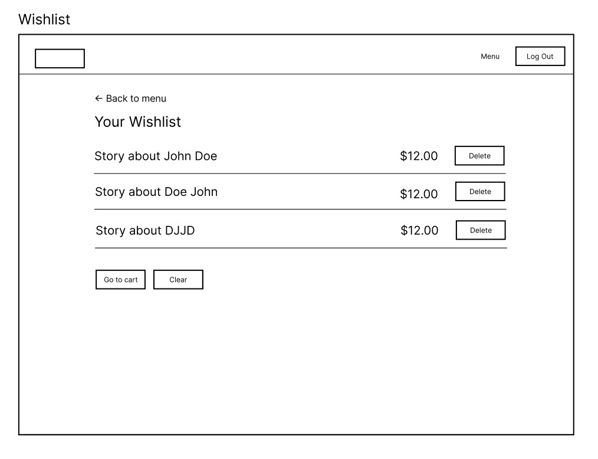

# ShelfWise

## 1. Introduction
ShelfWise is an online platform designed to provide a seamless book-shopping experience. It allows users to explore a diverse collection of books, discover new reads, and manage their purchases effortlessly. The platform aims to create an intuitive and user-friendly environment, catering to both casual readers and avid book collectors.

## 2. Features
ShelfWise includes the following features:

- **User Authentication** – Secure JWT-based authentication for users, enabling account creation and login.
- **Book Browsing & Search** – Users can explore a vast collection of books, filter by genre, author, and price, and sort results for better discovery.
- **Shopping Cart & Wish List** – Users can add books to their cart for immediate purchase or save them to a wishlist for later.
- **Order Management** – Users can place, track, and manage their orders, with updates on order status.

## 3. User Interface
ShelfWise includes the following pages:

- **Home Page** – Provides an overview of the platform, with a Call-to-Action button leading to registration or login.
- **Login/Register Page** – Allows users to create an account or log in to access personalized features like shopping cart and wishlist.
- **All Books Page** – Browse the entire collection of books, search by keywords, and filter by genre, author, and price.
- **Book Preview Page** – View detailed book information, including title, author, description, and price, with options to add to cart or wishlist.
- **Shopping Cart Page** – Review selected books, manage cart items, and proceed to checkout for purchase.
- **Wishlist Page** – Save books for future purchase and move them to the shopping cart when ready.
- **My Orders Page** – View detailed information about the user’s previous orders and their progress.


## 4. Functionality

### 4.1. Home Page [#1](https://github.com/hanadigaribovic/shelfwise-issues/issues/1)
The **Home Page** provides a brief overview of the web application, with an emphasis on guiding users toward registration or login.

#### Components on the Home Page:
- **Call-to-Action button** – Directs users to the **Login/Register Page**.
- **Basic demo of the platform** – A preview of how ShelfWise works, but without search or filtering functionalities.


### 4.2. Login/Register Page [#2](https://github.com/hanadigaribovic/shelfwise-issues/issues/2)
The **Login/Register Page** allows users to authenticate and gain access to personalized features.

#### Elements on the page:
- **Login form** – Users enter their credentials to sign in.
- **Register form** – Users create an account by providing their details.


#### Navigation from this page:
- **Back to Home Page**
- **Navigate to All Books Page** after successful login.

### 4.3. All Books Page [#3](https://github.com/hanadigaribovic/shelfwise-issues/issues/3)
The **All Books Page** enables users to browse the complete collection of books available on the platform.

#### Elements on the page:
- **Search bar** – Allows users to search for books by title, author, or keywords.
- **Filters and sorting options** – Users can filter books by genre, author, and price.
- **Book list/grid** – Displays all books with a preview of the title, author, and price.
- **Click on a book** – Redirects users to the **Book Preview Page** for more details.


#### Navigation from this page:
- **Back to Home Page**
- **Navigate to Book Preview Page** when a book is selected.

### 4.4. Book Preview Page [#4](https://github.com/hanadigaribovic/shelfwise-issues/issues/4)
The **Book Preview Page** opens when a user clicks on a book. This page displays detailed information about the selected book.

#### Elements on the page:
- **Book title and author**
- **Book description**
- **Book price** (if available for purchase)
- **"Add to Cart" button** – Allows the user to add the book to their shopping cart.
- **"Add to Wishlist" button** – Enables the user to save the book for later.


#### Navigation from this page:
- **Back to All Books Page**
- **Navigate to Shopping Cart Page** if the user adds a book to their cart.
- **Navigate to Wishlist Page** if the user saves a book.

### 4.5. Shopping Cart Page [#5](https://github.com/hanadigaribovic/shelfwise-issues/issues/5)
The **Shopping Cart Page** allows users to review and manage the books they have added to their cart.

#### Elements on the page:
- **List of books in the cart**, displaying title, author, and price.
- **Remove button** – Allows users to remove a book from the cart.
- **Total order amount** – Displays the total price of books in the cart.
- **"Proceed to Checkout" button** – Redirects the user to the **Order Management Page**.


#### Navigation from this page:
- **Back to Book Preview Page**
- **Back to All Books Page**
- **Navigate to Order Management Page**.

### 4.6. Wishlist Page [#6](https://github.com/hanadigaribovic/shelfwise-issues/issues/6)
The **Wishlist Page** allows users to save books for later purchase.

#### Elements on the page:
- **List of saved books**, displaying title and author.
- **"Move to Cart" button** – Moves a book from the Wishlist to the Shopping Cart.
- **Remove button** – Allows users to remove a book from the Wishlist.



#### Navigation from this page:
- **Back to All Books Page**
- **Navigate to Shopping Cart Page**.

### 4.7. Order Management Page [#7](https://github.com/hanadigaribovic/shelfwise-issues/issues/7)
The **Order Management Page** allows users to complete their purchases and track their orders.

#### Elements on the page:
- **Customer details form** – Fields for name, surname, address, and payment method.
- **Order summary** – Displays total price and list of books.
- **"Confirm Order" button** – Completes the purchase.
- **Order history list** – Shows the status of previous orders (e.g., "Shipped", "Delivered").


 


#### Navigation from this page:
- **Back to Shopping Cart Page**
- **Back to All Books Page**.

## 5. API Documentation
### 5.1. API Endpoints

| #  | Method  | Endpoint        | Request DTO      | Response DTO         | Description                                     |
|----|---------|----------------|------------------|----------------------|-------------------------------------------------|
| 1  | Create  | `/register`     | `UserDto`        | `UserDto`            | Creates a new user account.                     |
| 2  | Create  | `/login`        | `LoginDto`       | `TokenDto`           | Authenticates user and returns a JWT token.     |
| 3  | Read    | `/books`        | `-`              | `List<BookDto>`      | Returns a list of all available books.          |
| 4  | Read    | `/books/{id}`   | `-`              | `BookDto`            | Returns details of a specific book.             |
| 5  | Create  | `/cart`         | `CartDto`        | `CartDto`            | Adds a book to the shopping cart.               |
| 6  | Read    | `/cart`         | `-`              | `List<CartDto>`      | Returns the current contents of the cart.       |
| 7  | Delete  | `/cart/{id}`    | `-`              | `-`                  | Removes a book from the shopping cart.          |
| 8  | Create  | `/wishlist`     | `WishlistDto`    | `WishlistDto`        | Adds a book to the wishlist.                    |
| 9  | Read    | `/wishlist`     | `-`              | `List<WishlistDto>`  | Returns all books in the wishlist.              |
| 10 | Delete  | `/wishlist/{id}`| `-`              | `-`                  | Removes a book from the wishlist.               |
| 11 | Create  | `/order`        | `OrderDto`       | `OrderDto`           | Creates a new order.                            |
| 12 | Read    | `/order/{id}`   | `-`              | `OrderDto`           | Returns details of a specific order.            |
| 13 | Read    | `/order`        | `-`              | `List<OrderDto>`     | Returns all orders for a user.                  |


### 5.2. Data Transfer Objects
```
UserDto
{
  id: number,
  name: string,
  email: string,
  password: string
}
```
```
LoginDto
{
  email: string,
  password: string
}
```
```
TokenDto
{
  token: string
}
```
```
BookDto
{
  id: number,
  title: string,
  author: string,
  genre: string,
  price: number,
  description: string
}
```
```
CartDto
{
  id: number,
  userId: number,
  bookId: number,
  quantity: number
}
```
```
WishlistDto
{
  id: number,
  userId: number,
  bookId: number
}
```
```
OrderDto
{
  id: number,
  userId: number,
  totalPrice: number,
  status: string, 
  orderDate: string
}
```
## 6. Technical Requirements
ShelfWise is built using the following technologies:

- **Frontend:** Angular  [#8](https://github.com/hanadigaribovic/shelfwise-issues/issues/8)
- **Backend:** Java, Spring, PostgreSQL  [#9](https://github.com/hanadigaribovic/shelfwise-issues/issues/9)
- **Hosting:** The frontend and backend are hosted on a **Netlify** cloud server.  [#10](https://github.com/hanadigaribovic/shelfwise-issues/issues/10)

## 7. Out of Scope

- **Admin Panel** – Admins can manage book inventory, track orders, and oversee platform operations efficiently. [#11](https://github.com/hanadigaribovic/shelfwise-issues/issues/11)
- **Physical Store Integration** – The platform operates solely as an online bookstore and does not support in-store pickup or integration with physical stores. [#12](https://github.com/hanadigaribovic/shelfwise-issues/issues/12)
- **Multivendor Marketplace** – Only platform administrators can add books; third-party sellers cannot list their own books. [#13](https://github.com/hanadigaribovic/shelfwise-issues/issues/13)
- **Audiobooks & eBooks** – The bookstore focuses on physical books and does not support the purchase or download of digital or audio formats. [#14](https://github.com/hanadigaribovic/shelfwise-issues/issues/14)
- **Book Reviews & Ratings** – Users cannot leave reviews or rate books in this version of the platform. [#15](https://github.com/hanadigaribovic/shelfwise-issues/issues/15)


